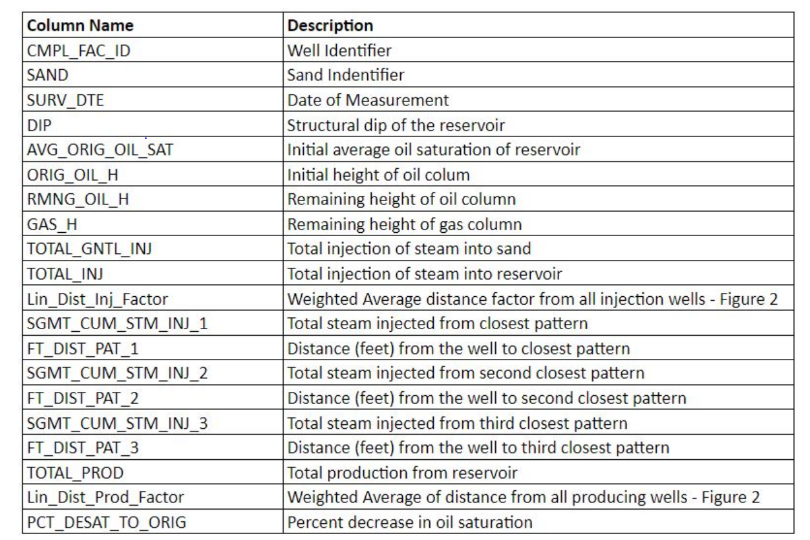

#### Project Title

# Steam Optimization and Other Oddities (Oct-2021)

Create a model that describes steam movement and oil desaturation for one of their primary fields using geoscience data collected from decades of operations.

## Project structure
├── data\
│   ├── sample_submission.csv\
│   ├── test.csv\
│   └── train.csv\
├── main.ipynb\
├── images\
├── submissions\
├── requirements.txt\
└── License

### Prerequisites

```bash
pip install -r requirements.txt
```

### Usage

#### DESCRIPTION OF THE DATASET



### Summary

- Ensembling 
- Optuna
- Neural Networks
- Lazy Predictions
- AutoML
- Feature Engineering